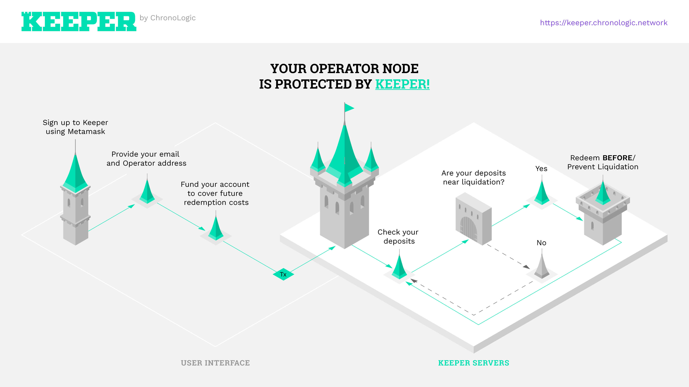
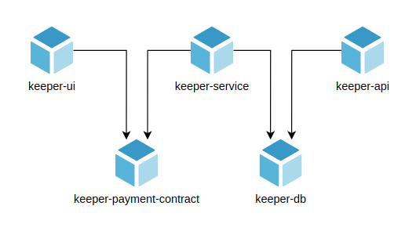
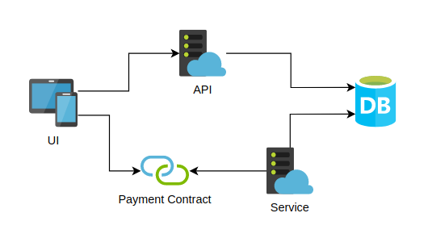

# Keeper

This is the main repository for the Keeper project.

## Introduction

Keeper is a service for [Keep Network](https://keep.network/) Node Operators to help prevent liquidations due to undercollateralization.

You can read more about this project at our [blog](https://blog.chronologic.network/) and https://blog.chronologic.network/draft-chronologic-is-awarded-grant-from-keep-network-7c3d0e36a4be

## Project overview

The project consists of the following repositories:

- https://github.com/chronologic/keeper-service (this repository)
- https://github.com/chronologic/keeper-api
- https://github.com/chronologic/keeper-ui
- https://github.com/chronologic/keeper-db
- https://github.com/chronologic/keeper-payment-contract

This is how those repositories are interconnected:

And this is how they interact:

## Repository overview

This repository holds the core logic of the Keeper service.
Its main responsibilities are:

- updating the list of active deposits
- checking collateralization of deposits
- executing the redeem/mint cycle for undercollateralized deposits
- monitoring system asset balances (ETH/TBTC/BTC)
- monitoring users' asset balances (ETH)
- processing users' payments for the service
- sending email notifications

The next section describes them in detail.

### Main functionalities

All logic described below is also executed at system startup to ensure proper operation. See `src/manager.ts`.

#### Updating list of active deposits

Located in `src/services/depositSync.ts`.

This process runs periodically (every few minutes) and scans the blockchain for new `Active` deposits to put in the database.

By storing the deposits in the database we create an internal audit trail of what deposits the service is aware of and minimize external calls to RPC provider which reduces potential cost of running the service.

The process does not need to immediately detect new deposits since it's rather unlikely that a new deposit would instantly become undercollateralized.

#### Checking collateralization of deposits

Located in `src/services/depositMonitor.ts`.

This process runs periodically (every few minutes) and checks the current collateralization % of the deposits in the database. Only deposits related to users that have a high enough balance to cover potential redemption are checked.

The process fetches the current BTC/ETH exchange rate and calculates collateralization based on lot size and amount of bonded ETH. It then compares that value with the deposit's undercollateralized threshold to determine whether it should be redeemed.

If a deposit is deemed undercollateralized, it's marked for redemption in the database and the redeem/mint process is initialized.

#### Executing the redeem/mint cycle for undercollateralized deposits

Located in `src/services/redeemMint`.

The Keeper service relies on the fact that once a deposit is redeemed, the released BTC can be recycled and used to mint more TBTC that can be used for another redemption. This is called the "redeem/mint cycle".

This process executes that cycle. Each step has a simple, uniform structure:

- execute a transaction
- confirm the transaction

Current state and progress, as well as transaction hash and cost are stored in the database so that the process is able to resume an interrupted cycle (e.g. due to an outage).

The implementation redeems/mints one deposit at a time to simplify accounting, TBTC/BTC/ETH and state management. This is deemed appropriate, since the service is designed to start the redemption process even before courtesy call, which should give enough time for all deposits to be redeemed in time.

Due to high cost of the redeem/mint cycle (>150 USD at the time writing), redeeming smaller lot sizes might actually cost more than letting them get liquidated. Therefore, the minimum accepted lot size can be configured in the system.

The process sends email notifications to system admins and affected users when:

- cycle is started
- cycle is completed
- error was encountered

#### Monitoring system asset balances (ETH/TBTC/BTC)

Located in `src/services/systemAccountingHelper.ts`.

The system consumes ETH, TBTC and BTC during redeeming and minting. By far the biggest amount of asset required is TBTC, since it has to cover the large lot sizes (up to 10 BTC at the time of writing).

It is advised to keep only the minimum amount of each asset to ensure proper operation (e.g. 10.1 TBTC, 1 ETH, 0.1 BTC) and have extra funds ready in safe storage.

The system will perform two different checks:

- ensuring minimal system balances are in the system wallets before starting redemption
- comparing balances before redemption to those after minting (the 'after' should be very close to the 'before') to make sure there's no asset 'leakage'

In case of any issues detected, a notification is sent to system admin email(s).

#### Monitoring users' asset balances (ETH)

Located in `src/services/userAccountingHelper.ts`.

For user convenience, the system only accepts ETH payments even though it needs also TBTC and BTC to operate. It is up to system admins to keep all asset balances at proper levels.

During operation, the system converts all non-ETH costs to ETH using current exchange rate and charges them to the user's account.

After each redeem/mint cycle, balances of users related to the redeemed deposit are checked. If they are below a certain level, an email notification is sent to their address.

#### Processing users' payments for the service

Located in `src/services/paymentProcessor.ts`.

Every few minutes, the payment smart contract is scanned for new payments. All new payments are stored in the database and the appropriate user is credited with the amount. The user also receives an email confirmation of the payment.

### Environment variables

This repo uses [`dotenv`](https://www.npmjs.com/package/dotenv) to load environment variables.

For development, and `.env` file should be created based on the `.env.example` template file. The `.env` file should never be commited.

In production, environment variables can be injected directly.

| Name                                | Type     | Default    | Description                                                                                                                        |
| ----------------------------------- | -------- | ---------- | ---------------------------------------------------------------------------------------------------------------------------------- |
| `LOG_LEVEL`                         | `string` | `info`     | Standard [`npm`](https://github.com/winstonjs/winston#logging-levels) log level                                                    |
| `DB_URL`                            | `string` |            | PostgreSQL connection string                                                                                                       |
| `ETH_NETWORK`                       | `string` |            | Name of Ethereum network to connect to (`mainnet`/`ropsten`/...)                                                                   |
| `INFURA_API_KEY`                    | `string` |            | API key for [Infura](https://infura.io/) (even the free account should be more than enough to run the service)                     |
| `ETH_XPRV`                          | `string` |            | `xprv` of the system ETH/TBTC account                                                                                              |
| `ELECTRUMX_NETWORK`                 | `string` |            | Name of Bitcoin network to connect to (`main`/`testnet`/`regtest`)                                                                 |
| `ELECTRUMX_HOST`                    | `string` |            | Host of the electrumx server to connect to                                                                                         |
| `ELECTRUMX_PORT`                    | `string` |            | Port of the electrumx server to connect to                                                                                         |
| `ELECTRUMX_PROTOCOL`                | `string` |            | Protocol of the electrumx server to connect to (`wss`/`ssl`)                                                                       |
| `BTC_ZPRV`                          | `string` |            | `zprv` of the system BTC wallet (must be `zprv`, not `xprv` or `yprv`)                                                             |
| `MAILJET_API_KEY`                   | `string` |            | API key for [Mailjet](https://www.mailjet.com/) mail service                                                                       |
| `MAILJET_API_SECRET`                | `string` |            | API secret for [Mailjet](https://www.mailjet.com/) mail service                                                                    |
| `ADMIN_EMAIL_RECIPIENTS`            | `string` |            | Comma-separated list of admin emails for system notifications                                                                      |
| `EMAIL_SENDER`                      | `string` |            | Email address that will be seen as the sender by notifications recipients                                                          |
| `MIN_USER_BALANCE_ETH`              | `number` | `0.5`      | Minimum user ETH balance. Below this level the user's deposits will not be protected by the service.                               |
| `WARNING_USER_BALANCE_ETH`          | `number` | `0.75`     | Warning user ETH balance. Below this level user will start receiving email reminders to top up their ETH.                          |
| `USER_TX_FEE_PERCENT`               | `number` | `0`        | Extra fee (in `%`) added to all transactions executed to prevent a user from getting liquidated. This makes the system profitable. |
| `SYNC_MIN_BLOCK`                    | `number` | `10880657` | The deposit sync process will start the initial sync from this block.                                                              |
| `COLLATERAL_CHECK_INTERVAL_MINUTES` | `number` | `5`        | How often (in minutes) the system should be checking collateralization of deposits.                                                |
| `COLLATERAL_BUFFER_PERCENT`         | `number` | `5`        | `undercollateralizedThreshold` for a given deposit + `COLLATERAL_BUFFER_PERCENT` => threshold at which the service will start      |
| `MIN_LOT_SIZE_BTC`                  | `number` | `1`        | For smaller lot sizes it may be cheaper to get liquidated than to redeem.                                                          |
| `MAX_LOT_SIZE_BTC`                  | `number` | `1000`     | This is used mainly for testing/dev purposes to force the system to only redeem specific lot sizes.                                |
| `WARNING_SYSTEM_TBTC_BALANCE`       | `number` | `0`        | If system TBTC balance falls below this level, system will start sending email notifications to admins.                            |
| `MIN_SYSTEM_TBTC_BALANCE`           | `number` | `0`        | If system TBTC balance falls below this level, system will halt.                                                                   |
| `WARNING_SYSTEM_BTC_BALANCE`        | `number` | `0`        | If system BTC balance falls below this level, system will start sending email notifications to admins.                             |
| `MIN_SYSTEM_BTC_BALANCE`            | `number` | `0`        | If system BTC balance falls below this level, system will halt.                                                                    |
| `WARNING_SYSTEM_ETH_BALANCE`        | `number` | `0`        | If system ETH balance falls below this level, system will start sending email notifications to admins.                             |
| `MIN_SYSTEM_ETH_BALANCE`            | `number` | `0`        | If system ETH balance falls below this level, system will halt.                                                                    |

### Deployment

This project is configured to be deployed on https://heroku.com. The deployment config can be found in `Procfile`.

Detailed deployment instructions can be found [here](https://devcenter.heroku.com/articles/deploying-nodejs).

### Monitoring the service (availability)

Monitoring is outside of the scope of this project. A monitoring solution may be added as needed, e.g. `pm2`, `prometheus` + `grafana` etc.

### Building

Run `npm run build`.

### Development

Run `npm run dev`.

### Disclaimer

The Keeper Service does not guarantee that a deposit will be redeemed before liquidation. The redemption process may fail due to a number of reasons, including but not limited to: network congestion, market conditions, Node Operator availability.

The Keeper Service maintainers may not be held liable for any damages or loss of funds that arise from using the Service.

### How do users withdraw their ETH?

Currently, there is no automatic way for users to withdraw their ETH if e.g. they want to stop using the service. Instead, the user should contact the service admins and they should return the funds manually.

To make sure the user's balance in the system is correct after returning the funds, the user has to be either removed from the database, or a record in the `payment` table has to be added to zero out the balance.

### Additional Links

- Website: https://chronologic.network/
- Twitter: https://twitter.com/chronologiceth
- Medium: https://blog.chronologic.network/
- Telegram: https://t.me/chronologicnetwork
- Github: https://github.com/chronologic/
